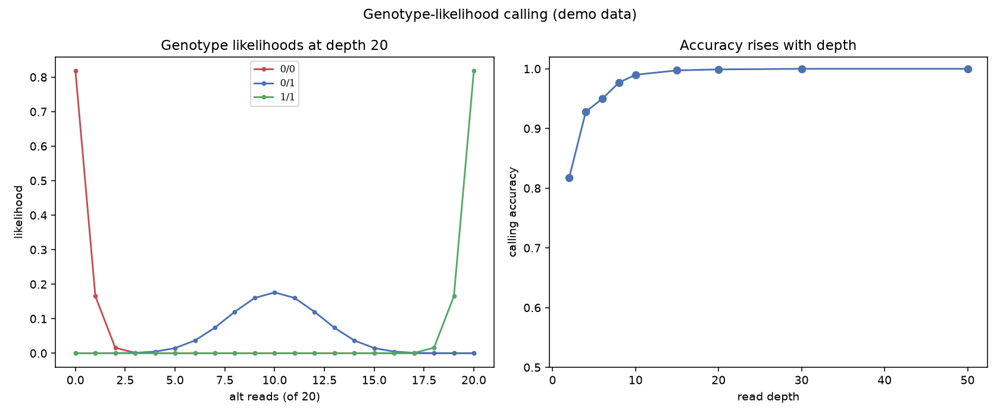

# Genotype Likelihood Caller

How does a variant caller decide you are AA, AG, or GG at a position? It does not just count reads — it computes the *likelihood* of each genotype given the data and the sequencing error rate. This project builds that core calculation from scratch.

## Why This Matters

Naively calling a genotype from allele fractions falls apart at low coverage: three alt reads out of five could be a true heterozygote or a homozygote with errors. Genotype likelihoods handle this properly. For each candidate genotype they model the expected fraction of alt reads (0 for hom-ref, 0.5 for het, 1 for hom-alt) under a binomial with the base-error rate, and the most likely genotype wins. This is the statistical heart of GATK, bcftools, and every modern caller — and it is why deeper coverage buys you confidence.

## How It Works

1. For a site with `alt` alternate reads out of `dp` total, compute the binomial likelihood of each genotype.
2. Call the genotype with the highest likelihood.
3. Measure calling accuracy as a function of read depth.

## What the Demo Shows



The left panel shows how the three genotype likelihoods separate as alt-read count changes at 20x depth. The right panel shows the payoff: calling accuracy climbs steeply with depth, the quantitative reason low-coverage calls are untrustworthy.

## Run It

```bash
pip install -r requirements.txt
python demo.py
```

> Demonstrated on synthetic data, so it's fully reproducible with no external downloads.
